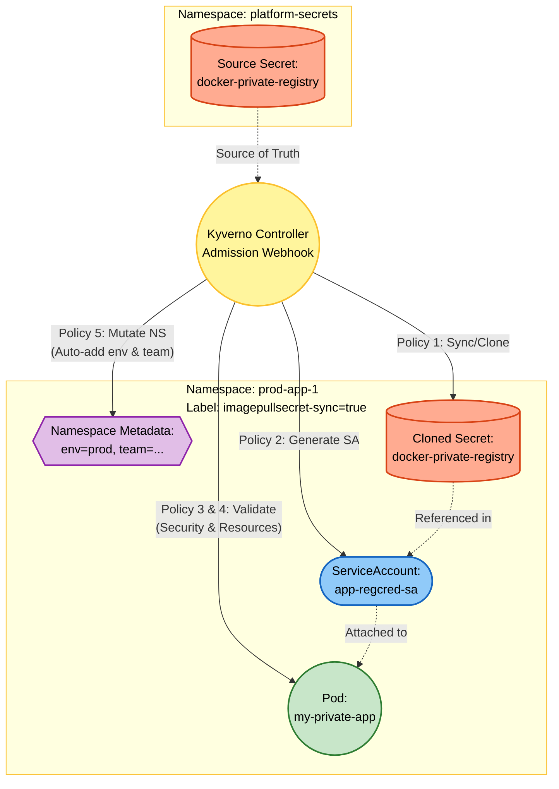

# Kyverno Project 1 – Image Pull Secret Automation & Workload Standardization

## Foundational Theory

### Problem to Solve

In real-world Kubernetes environments, software development teams often face repetitive issues:

1. **Manual Secret Management**: Every time a new Namespace is created, DevOps must recreate the authentication Secret (Docker Registry credentials) for each Namespace individually. This is time-consuming, error-prone, and lacks consistency.
2. **Lack of Workload Standardization**: Developers often forget to declare `resources.limits` (CPU/RAM limits), leading to a single Pod consuming all resources of a Node. Or they forget to attach the `app` label, making monitoring/tracing impossible.
3. **Image Security Risks**: Pods might pull images from a Private Registry without declaring `imagePullSecrets`, leading to `ImagePullBackOff` errors, or worse, pulling a spoofed/malicious image.

### Solution: Kyverno Policy-as-Code

Kyverno operates as an **Admission Webhook** situated between kubectl and the Kubernetes API Server. All requests to create/update/delete resources must pass through Kyverno before being stored in etcd. Kyverno provides three main mechanisms:

| Mechanism | Role | Example |
|---|---|---|
| **Validate** | Blocks invalid resources | Blocks a Pod missing the `app` label |
| **Mutate** | Automatically inserts/modifies configurations | Automatically adds the `environment` label |
| **Generate** | Automatically creates new resources upon events | Clones a Secret to a new Namespace |

### Kyverno Components Used in Project 1

- **ValidatingPolicy / ClusterPolicy (Validate)**: Verifies if Pods have sufficient labels and resources; checks if Pods have `imagePullSecrets` when pulling from a Private Registry.
- **MutatingPolicy / ClusterPolicy (Mutate)**: Automatically adds the `environment` label and `team` annotation to new Namespaces.
- **GeneratingPolicy / ClusterPolicy (Generate)**: Clones a Secret from a source Namespace; creates a ServiceAccount with `imagePullSecrets`.
- **Key Blocks**: `match/exclude`, `generate.clone`, `generate.data`, `mutate.patchStrategicMerge`, `validate.pattern`, `validate.deny`.

---

## Overall Architecture

This project is a perfect combination of **5 Policies** operating sequentially in a closed automation pipeline:



### Detailed Analysis of 5 Policies:

| # | File | Type | Task |
|---|---|---|---|
| 1 | `kyverno-policy-1.yaml` | Generate (Clone) | Clones the `docker-private-registry` Secret from `platform-secrets` to Namespaces labeled with `imagepullsecret-sync=true` |
| 2 | `kyverno-policy-2.yaml` | Generate (Data) | Creates the `app-regcred-sa` ServiceAccount associated with the cloned `imagePullSecrets` |
| 3 | `kyverno-policy-3.yaml` | Validate (Deny) | Blocks Pods pulling images from a Private Registry without `imagePullSecrets` |
| 4 | `kyverno-policy-4.yaml` | Validate (Pattern) | Requires Pods to have the `app` label and declare CPU/RAM `resources.requests/limits` |
| 5 | `kyverno-policy-5.yaml` | Mutate | Automatically adds `environment=dev/prod` label and `team=unknown-team` annotation to new Namespaces |

---

## Deployment Guide

### Step 1: Initialize the Core Secret Source

```bash
# Create the namespace for the source Secret
kubectl create ns platform-secrets

# Create the Docker Registry authentication Secret (replace credentials with actual data)
kubectl create secret docker-registry docker-private-registry \
  --docker-server=registry.tranvix.click \
  --docker-username=admin \
  --docker-password='your-password' \
  -n platform-secrets
```

### Step 2: Grant RBAC Permissions to Kyverno

```bash
kubectl apply -f kyverno-rbac.yaml
```

### Step 3: Deploy the 5 Policies

```bash
kubectl apply -f kyverno-policy-1.yaml   # Generate: Clone Secret
kubectl apply -f kyverno-policy-2.yaml   # Generate: Create ServiceAccount
kubectl apply -f kyverno-policy-3.yaml   # Validate: Check imagePullSecrets
kubectl apply -f kyverno-policy-4.yaml   # Validate: Check labels & resources
kubectl apply -f kyverno-policy-5.yaml   # Mutate: Auto-label Namespace
```

### Step 4: Check Status

```bash
kubectl get clusterpolicies
```

---

## User Guide (For Developers)

When deploying applications, developers only need to follow 2 rules:

**1. Initialize the Namespace according to the standard:**
```bash
kubectl create ns prod-app-1
kubectl label ns prod-app-1 imagepullsecret-sync=true
```

**2. Declare the Pod in compliance with the required standards:**
```yaml
apiVersion: v1
kind: Pod
metadata:
  name: my-private-app
  namespace: prod-app-1
  labels:
    app: backend-api           # REQUIRED by Policy 4
spec:
  serviceAccountName: app-regcred-sa  # REQUIRED by Policies 2 & 3
  containers:
  - name: app
    image: registry.tranvix.click/my-app:v1.0
    resources:                 # REQUIRED by Policy 4
      requests:
        memory: "64Mi"
        cpu: "250m"
      limits:
        memory: "128Mi"
        cpu: "500m"
```

---

## Test Cases

### Test Case 1: Automatic Namespace Classification (Policy 5 – Mutate)

**Goal:** Create a Namespace containing `-dev` and verify if Kyverno automatically adds metadata.

```bash
kubectl create ns test-api-dev
kubectl get ns test-api-dev --show-labels
kubectl describe ns test-api-dev
```

**Expected Result:** The Namespace is automatically labeled with `environment=dev` and annotated with `team=unknown-team`.

---

### Test Case 2: Pod Enforcement (Policy 4 – Validate)

**Goal:** Intentionally create a Pod missing the required labels and resources.

```bash
kubectl apply -f - <<EOF
apiVersion: v1
kind: Pod
metadata:
  name: bad-pod
spec:
  containers:
  - name: alpine
    image: alpine
EOF
```

**Expected Result:** The request is BLOCKED with messages indicating missing `labels: app` and missing `resources.requests/limits`.

---

### Test Case 3: Block Unauthorized Private Image Pulls (Policy 3 – Validate)

**Goal:** Pull an image from the Private Registry without declaring `serviceAccountName`.

```bash
kubectl apply -f - <<EOF
apiVersion: v1
kind: Pod
metadata:
  name: illegal-image-pod
  labels:
    app: test
spec:
  containers:
  - name: app
    image: registry.tranvix.click/wineapp/wineapp-frontend:latest
    resources:
      requests:
        memory: "64Mi"
        cpu: "250m"
      limits:
        memory: "128Mi"
        cpu: "500m"
EOF
```

**Expected Result:** The request is BLOCKED with the warning: `An imagePullSecret is required when pulling from this registry`.

---

### Test Case 4: Perfect Deployment Flow (All Policies)

**Goal:** Execute the correct process from start to finish.

```bash
# 1. Create Namespace and enable sync (Policies 1, 2, 5)
kubectl create ns test-perfect-ns
kubectl label ns test-perfect-ns imagepullsecret-sync=true

# 2. Verify that Secret and ServiceAccount have been automatically created
kubectl get secret docker-private-registry -n test-perfect-ns
kubectl get sa app-regcred-sa -n test-perfect-ns

# 3. Deploy a compliant Pod (Passes Policies 3 & 4)
kubectl apply -f - <<EOF
apiVersion: v1
kind: Pod
metadata:
  name: perfect-pod
  namespace: test-perfect-ns
  labels:
    app: test
spec:
  serviceAccountName: app-regcred-sa
  containers:
  - name: app
    image: registry.tranvix.click/wineapp/wineapp-frontend:latest
    resources:
      requests:
        memory: "64Mi"
        cpu: "250m"
      limits:
        memory: "128Mi"
        cpu: "500m"
EOF
```

**Expected Result:** The Pod is successfully created, passing all 5 validation checks and pulling the image securely.

---

## Production Deployment Notes

### Safe Rollout Strategy
1. **Phase 1 – Audit:** Set `validationFailureAction: Audit` to log policy violations without blocking. View the reports using `kubectl get polr -A`.
2. **Phase 2 – Enforce:** Once all violations are resolved, switch to `Enforce` to start blocking non-compliant resources.

### Notes on Generate Policy
- The `synchronize: true` flag in Policy 1 will automatically recreate the Secret if someone deletes it. However, it will also scan existing Namespaces and insert the Secret into matching ones.
- Use `match` with a `selector` (`imagepullsecret-sync=true`) to apply only to designated Namespaces, avoiding system Namespaces.
