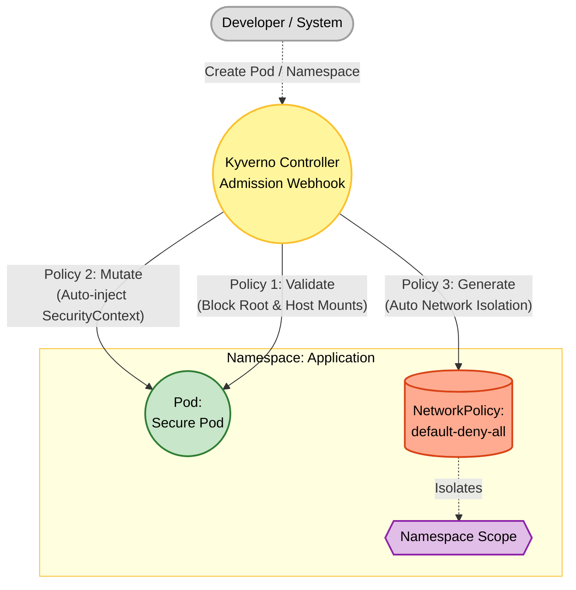

# Kyverno Project 2 – Pod Security & Network Baseline

## Foundational Theory

### Problem to Solve

By default, Kubernetes does not enforce any security constraints on Pods. This means:

1. **Running as root**: Containers run as `root` (UID 0) by default. If a hacker exploits an application vulnerability, they gain root access inside the container and can attempt to escape to the host Node.
2. **Privileged mode**: Developers might accidentally (or intentionally) enable `privileged: true`, allowing the container direct access to the host Node's hardware and kernel.
3. **Host mounts**: A container can mount the host's root directory (`/`) or Docker socket (`/var/run/docker.sock`), allowing full control over the host.
4. **Lack of Network Isolation**: By default, all Pods in a cluster can communicate freely with each other. If one Pod is compromised, a hacker can perform lateral movement to target other Pods.

### Solution: Defense-in-Depth with Kyverno

Project 2 applies a **Defense-in-Depth** strategy consisting of 3 layers:

| Layer | Kyverno Mechanism | Task |
|---|---|---|
| Layer 1 – Prevention | **Validate** (Enforce) | Immediately blocks Pods violating security rules |
| Layer 2 – Remediation | **Mutate** | Automatically patches security configurations for Developers |
| Layer 3 – Isolation | **Generate** | Automatically creates a deny-all NetworkPolicy for new Namespaces |

### Kyverno Components Used in Project 2

- **ValidatingPolicy / ClusterPolicy (Validate)**: Validates securityContext, hostNetwork, hostPID, hostPath, runAsNonRoot, readOnlyRootFilesystem.
- **MutatingPolicy / ClusterPolicy (Mutate)**: Automatically inserts `runAsNonRoot: true` and `allowPrivilegeEscalation: false` if missing.
- **GeneratingPolicy / ClusterPolicy (Generate)**: Generates a `deny-all` NetworkPolicy for new Namespaces (Data Source mode).
- **Key Blocks**: `validate.pattern`, `validate.deny.conditions`, `mutate.patchStrategicMerge` (indicated by `+`), `generate.data`, `synchronize`.

---

## Overall Architecture



### Detailed Analysis of 3 Policies:

| # | File | Type | Task |
|---|---|---|---|
| 1 | `policy-1-validate-security.yaml` | Validate (Enforce) | Prohibits `privileged`, `hostNetwork`, `hostPID`, and mounting `/` or `docker.sock`. Enforces `runAsNonRoot` and `readOnlyRootFilesystem`. |
| 2 | `policy-2-mutate-security.yaml` | Mutate | Automatically inserts `runAsNonRoot: true` (Pod level) and `allowPrivilegeEscalation: false` (Container level) if missing. |
| 3 | `policy-3-generate-network.yaml` | Generate (Data Source) | Creates a `default-deny-all` NetworkPolicy that blocks all Ingress/Egress traffic for any new Namespace. |

### Execution Flow when Creating a Pod (Order is Extremely Important):

```
kubectl apply → Mutating Webhook (Policy 2) → K8s Schema Validation → Validating Webhook (Policy 1) → etcd
```

1. **Mutating Webhook runs FIRST**: Policy 2 automatically inserts `securityContext` into the Pod.
2. **K8s Schema Validation**: Kubernetes checks logical consistency (e.g., `privileged: true` + `allowPrivilegeEscalation: false` = contradiction → error).
3. **Validating Webhook runs LATER**: Policy 1 validates the entire configuration after mutation has occurred.

> **Important Note:** If a Pod has `privileged: true` and Policy 2 automatically inserts `allowPrivilegeEscalation: false`, Kubernetes will raise a schema validation error before Policy 1 executes. This is not a bug; it is the multi-layered defense system functioning correctly!

---

## Deployment Guide

```bash
kubectl apply -f policy-1-validate-security.yaml   # Validate: Security rules
kubectl apply -f policy-2-mutate-security.yaml      # Mutate: Auto-inject security
kubectl apply -f policy-3-generate-network.yaml     # Generate: Network isolation
```

Check Status:
```bash
kubectl get clusterpolicies
```

---

## Test Cases

### Test Case 1: Test ValidatingPolicy (Block Hackers)

**Goal:** Attempt to deploy a Pod that uses host network and mounts `docker.sock`.

```bash
kubectl apply -f - <<EOF
apiVersion: v1
kind: Pod
metadata:
  name: hacker-pod
spec:
  hostNetwork: true
  containers:
  - name: alpine
    image: alpine
    securityContext:
      allowPrivilegeEscalation: true
    volumeMounts:
    - name: docker-sock
      mountPath: /var/run/docker.sock
  volumes:
  - name: docker-sock
    hostPath:
      path: /var/run/docker.sock
EOF
```

**Expected Result:** Blocked by Kyverno:
- `Using privileged: true, hostNetwork: true, or hostPID: true is forbidden.`
- `Mounting sensitive host paths (e.g., /, /var/run/docker.sock) is forbidden.`

> **Note:** If `privileged: true` is used instead of `allowPrivilegeEscalation: true`, Kubernetes native validation will fail first (due to Policy 2 injecting `allowPrivilegeEscalation: false`). To see the specific Kyverno validation error, set `allowPrivilegeEscalation: true` to bypass native Kubernetes validation.

---

### Test Case 2: Test MutatingPolicy (Automatic SecurityContext Injection)

**Goal:** Deploy a standard Pod and verify if Kyverno automatically injects security configurations.

```bash
kubectl apply -f - <<EOF
apiVersion: v1
kind: Pod
metadata:
  name: normal-pod
  labels:
    app: test
spec:
  containers:
  - name: nginx
    image: nginx
    securityContext:
      readOnlyRootFilesystem: true
    resources:
      requests:
        memory: "64Mi"
        cpu: "250m"
      limits:
        memory: "128Mi"
        cpu: "500m"
EOF
```

**Verification:**
```bash
kubectl get pod normal-pod -o yaml | grep runAsNonRoot
# Output: runAsNonRoot: true (Automatically injected by Kyverno)

# To check container security context:
kubectl get pod normal-pod -o jsonpath='{.spec.containers[0].securityContext}'
# Output should contain allowPrivilegeEscalation: false
```

> **Note:** The Pod may enter a `CreateContainerConfigError` state because the default `nginx` image runs as root, which is blocked by `runAsNonRoot: true`. This is expected behavior—security has been successfully tightened!

---

### Test Case 3: Test GeneratingPolicy (Auto Network Isolation)

**Goal:** Create a new Namespace and verify that a NetworkPolicy is automatically created.

```bash
# 1. Create Namespace
kubectl create ns project-alpha

# 2. Check NetworkPolicy
kubectl describe networkpolicy default-deny-all -n project-alpha
```

**Expected Result:**
- `PodSelector: <none>` (Applies to all Pods)
- `Allowing ingress traffic: <none>` (Inbound traffic isolated)
- `Allowing egress traffic: <none>` (Outbound traffic isolated)

---

## Production Deployment Notes

### Configuration of `background` and `synchronize`

| Policy Type | Flag | Recommendation | Reason |
|---|---|---|---|
| Validate | `background: true` | Recommended | Scans existing Pods for violations and records them in the `PolicyReport` without causing downtime |
| Mutate | `background: true` | Not Recommended | Causes conflicts with GitOps tools (ArgoCD/Flux), potentially causing infinite out-of-sync loops |
| Generate | `synchronize: true` | Use with Caution | Will insert the NetworkPolicy into ALL existing Namespaces, which could disrupt existing application communications |

### Mitigating Risks of Generate Policy on Running Clusters
Use the `exclude` block to exclude system Namespaces:
```yaml
match:
  any:
    - resources:
        kinds:
          - Namespace
exclude:
  any:
    - resources:
        names:
          - kube-system
          - kyverno
          - monitoring
```
