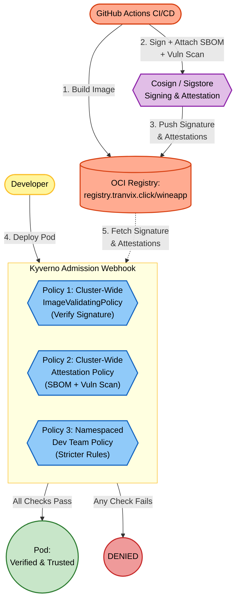

# Kyverno Project 3 – Image Security: ImageValidatingPolicy + Attestation

## Foundational Theory

### Problem to Solve

Projects 1 and 2 protected the cluster at the **Pod configuration** level (labels, resources, securityContext, network). However, they did not answer the most critical question:

> *"Is the container image running in the Pod actually safe and trustworthy?"*

Software supply chain risks include:

1. **Image Tampering**: Hackers compromise the Container Registry and replace legitimate images with malicious ones (containing backdoors). Pods pull and run these images without any awareness of the breach.
2. **Image containing Known Vulnerabilities**: Images built from old base images containing hundreds of unpatched CVEs (Common Vulnerabilities and Exposures).
3. **No Traceability**: When a security incident occurs (such as Log4Shell), it is impossible to identify which images use the affected libraries without a Software Bill of Materials (SBOM).

### Solution: Supply Chain Security with Sigstore + Kyverno

| Concept | Explanation | Tool |
|---|---|---|
| **Sign Image** | Similar to a notarized seal on a package. Proves the image was built by the official pipeline and has not been modified. | Cosign (Sigstore) |
| **SBOM** | Similar to an ingredient list. Lists all libraries, dependencies, and versions inside the image. | Syft, CycloneDX CLI |
| **Vulnerability Scan** | Similar to a health certificate. Verifies if components inside the image contain public security vulnerabilities. | Trivy, Grype, Snyk |
| **Attestation** | The act of attaching the documents above (SBOM, scan results) to the image in the OCI Registry, accompanied by a digital signature to prevent tampering. | Cosign attest |

### Kyverno Components Used in Project 3

- **ImageValidatingPolicy** (API `policies.kyverno.io/v1`): A cluster-scoped policy to verify image signatures and attestations.
- **NamespacedImageValidatingPolicy**: A namespace-scoped policy, allowing teams to manage their own rules.
- **Key Blocks**:
  - `matchImageReferences`: Filters which images are inspected (glob pattern or CEL expression).
  - `attestors.cosign`: Declares the signing authority (keyless OIDC or public key).
  - `attestors.cosign.ctlog`: Configures the transparency log (Rekor) to verify signatures via a public log.
  - `attestations`: Declares the attached metadata to check (SBOM, Vuln Scan).
  - `validationConfigurations`: Configurations for `mutateDigest`, `required`, `verifyDigest`.
  - `credentials`: Configures registry authentication (secrets, providers, allowInsecureRegistry).
- **CEL (Common Expression Language) Functions**:
  - `verifyImageSignatures(image, attestors)`: Verifies digital signatures of the image.
  - `verifyAttestationSignatures(image, attestation, attestors)`: Verifies if the attestation has a valid signature.
  - `extractPayload(image, attestation)`: Extracts attestation content for detailed validation. **Note:** Calling `verifyAttestationSignatures()` first is mandatory before using `extractPayload()`.

### Infrastructure CI/CD Requirements (Prerequisites)

Project 3 differs fundamentally from Projects 1 & 2: **Kyverno is only the "Ticket Inspector", not the "Ticket Issuer"**. The CI/CD pipeline must integrate the following steps:

```yaml
# Example GitHub Actions workflow (.github/workflows/build-sign-attest.yml)
steps:
  # 1. Build & Push image
  - run: docker build -t registry.tranvix.click/wineapp/wineapp-frontend:v1.0 . && docker push registry.tranvix.click/wineapp/wineapp-frontend:v1.0

  # 2. Sign image (Keyless via OIDC)
  - run: cosign sign registry.tranvix.click/wineapp/wineapp-frontend:v1.0

  # 3. Generate & attach SBOM (CycloneDX)
  - run: |
      syft registry.tranvix.click/wineapp/wineapp-frontend:v1.0 -o cyclonedx-json > sbom.json
      cosign attest --predicate sbom.json --type cyclonedx registry.tranvix.click/wineapp/wineapp-frontend:v1.0

  # 4. Scan vulnerabilities & attach results
  - run: |
      trivy image registry.tranvix.click/wineapp/wineapp-frontend:v1.0 --format cosign-vuln > vuln.json
      cosign attest --predicate vuln.json --type vuln registry.tranvix.click/wineapp/wineapp-frontend:v1.0
```

---

## Overall Architecture



### Detailed Analysis of 3 Policies:

| # | File | Type | Scope | Task |
|---|---|---|---|---|
| 1 | `policy-1-image-verify.yaml` | ImageValidatingPolicy | Cluster | Verifies digital signatures of images from `registry.tranvix.click/wineapp/*` signed by GitHub Actions OIDC |
| 2 | `policy-2-attestation-verify.yaml` | ImageValidatingPolicy | Cluster | Verifies SBOM (CycloneDX) and Vulnerability Scan attestations |
| 3 | `policy-3-dev-namespace.yaml` | NamespacedImageValidatingPolicy | Namespace `development` | Enforces stricter rules: `dev-*` images must be signed by members of `@myorg.github.io` |

---

## Detailed Policies

### Policy 1: Image Signature Verification (`policy-1-image-verify.yaml`)

**Task:** All images from `registry.tranvix.click/wineapp/*` must be digitally signed.

```yaml
apiVersion: policies.kyverno.io/v1
kind: ImageValidatingPolicy
metadata:
  name: verify-image-signatures
spec:
  validationActions: [Deny]
  failurePolicy: Fail
  webhookConfiguration:
    timeoutSeconds: 30
  matchConstraints:
    resourceRules:
      - apiGroups: [""]
        apiVersions: ["v1"]
        operations: ["CREATE", "UPDATE"]
        resources: ["pods"]
  matchImageReferences:
    - glob: "registry.tranvix.click/wineapp/*"
  credentials:
    secrets:
      - registry-secret
  attestors:
    - name: cosign
      cosign:
        keyless:
          identities:
            - issuer: "https://token.actions.githubusercontent.com"
              subjectRegExp: "https://github.com/tranvix0910/.*/.github/workflows/.*"
        ctlog:
          url: "https://rekor.sigstore.dev"
  validationConfigurations:
    mutateDigest: true      # Replaces image tag with SHA256 digest (prevents tag manipulation)
    required: true          # Requires a signature to be present
    verifyDigest: true      # Verifies signature matches the digest
  validations:
    - expression: >-
        images.containers.map(image, verifyImageSignatures(image, [attestors.cosign])).all(e, e > 0)
      message: >-
        All images from registry.tranvix.click/wineapp/* must be signed by GitHub Actions CI/CD.
        Unsigned or tampered images are strictly forbidden.
```

**Explanation:**
- **`keyless`**: Eliminates private key management. Cosign verifies identity via GitHub Actions OIDC token.
- **`subjectRegExp`**: Accepts workflows running from repositories under the `tranvix0910` organization only.
- **`ctlog`**: Verifies signature against Rekor transparency log (`rekor.sigstore.dev`), ensuring the signature is recorded publicly.
- **`mutateDigest: true`**: Kyverno replaces `:latest` with `@sha256:...`, preventing tag spoofing.
- **`verifyImageSignatures()`**: CEL function triggers Kyverno signature verification. Denied if `.verified == false`.

---

### Policy 2: Attestation Verification (`policy-2-attestation-verify.yaml`)

**Task:** The image must include an SBOM (CycloneDX) and Vulnerability Scan results.

```yaml
apiVersion: policies.kyverno.io/v1
kind: ImageValidatingPolicy
metadata:
  name: verify-image-attestations
spec:
  validationActions: [Deny]
  failurePolicy: Fail
  webhookConfiguration:
    timeoutSeconds: 30
  matchConstraints:
    resourceRules:
      - apiGroups: [""]
        apiVersions: ["v1"]
        operations: ["CREATE", "UPDATE"]
        resources: ["pods"]
  matchImageReferences:
    - glob: "registry.tranvix.click/wineapp/*"
  credentials:
    secrets:
      - registry-secret
  attestors:
    - name: cosign
      cosign:
        keyless:
          identities:
            - issuer: "https://token.actions.githubusercontent.com"
              subjectRegExp: "https://github.com/tranvix0910/.*/.github/workflows/.*"
        ctlog:
          url: "https://rekor.sigstore.dev"
  validationConfigurations:
    mutateDigest: true
    required: true
    verifyDigest: true
  attestations:
    - name: sbom
      referrer:
        type: sbom/cyclone-dx
    - name: cosignAttestation
      intoto:
        type: cosign.sigstore.dev/attestation/vuln/v1
  validations:
    - expression: >-
        images.containers.map(image, verifyAttestationSignatures(image, attestations.sbom, [attestors.cosign])).all(e, e > 0)
      message: >-
        All images must have a valid SBOM attestation signed by the CI/CD pipeline.
    - expression: >-
        images.containers.map(image, verifyAttestationSignatures(image, attestations.cosignAttestation, [attestors.cosign])).all(e, e > 0)
      message: >-
        All images must have a valid vulnerability scan attestation signed by the CI/CD pipeline.
    - expression: >-
        images.containers.map(image, extractPayload(image, attestations.sbom).bomFormat == "CycloneDX").all(e, e)
      message: >-
        All images must include a valid CycloneDX SBOM (Software Bill of Materials).
```

**Explanation:**
- **`attestations`**: Declares two types of metadata to look up on the OCI Registry:
  - `sbom`: SBOM document using CycloneDX standard (uses `referrer` for OCI artifact type).
  - `cosignAttestation`: Vulnerability scan results (uses `intoto` for in-toto predicate type).
- **`validationConfigurations`**: Includes this block with `required: true` to enforce validation.
- **`verifyAttestationSignatures()`**: Verifies that both the SBOM and vulnerability scan have valid signatures (prevents spoofed results). **Must be executed before `extractPayload()`.**
- **`extractPayload()`**: Extracts SBOM payload and verifies `bomFormat == "CycloneDX"`. Requires successful signature verification first.
- **`ctlog`**: Verifies signature against the Rekor transparency log.

---

### Policy 3: Namespaced Dev Team Policy (`policy-3-dev-namespace.yaml`)

**Task:** Development team manages their own rules inside the `development` namespace.

```yaml
apiVersion: policies.kyverno.io/v1
kind: NamespacedImageValidatingPolicy
metadata:
  name: dev-team-image-policy
  namespace: development
spec:
  validationActions: [Deny]
  failurePolicy: Fail
  webhookConfiguration:
    timeoutSeconds: 30
  matchConstraints:
    resourceRules:
      - apiGroups: [""]
        apiVersions: ["v1"]
        operations: ["CREATE", "UPDATE"]
        resources: ["pods"]
  matchImageReferences:
    - glob: "registry.tranvix.click/wineapp/dev-*"
  credentials:
    secrets:
      - registry-secret
  attestors:
    - name: devCosign
      cosign:
        keyless:
          identities:
            - issuer: "https://token.actions.githubusercontent.com"
              subjectRegExp: "https://github.com/tranvix0910/.*/.github/workflows/.*"
        ctlog:
          url: "https://rekor.sigstore.dev"
  validationConfigurations:
    mutateDigest: true
    required: true
    verifyDigest: true
  validations:
    - expression: >-
        images.containers.map(image, verifyImageSignatures(image, [attestors.devCosign])).all(e, e > 0)
      message: >-
        Dev team images (registry.tranvix.click/wineapp/dev-*) must be signed by tranvix0910 CI/CD.
```

**Explanation:**
- **`NamespacedImageValidatingPolicy`**: A namespace-scoped policy instead of a cluster-wide policy. It only evaluates resources within its namespace (`development`), allowing dev leads to manage rules without requiring cluster-admin privileges. No `namespaceSelector` is required since scoping is defined by `metadata.namespace`.
- **`matchImageReferences: registry.tranvix.click/wineapp/dev-*`**: Targets images with the `dev-` prefix.
- **`ctlog`**: Verifies signature against the Rekor transparency log.
- **`subjectRegExp`**: Matches workflow identities, ensuring only workflows from the `tranvix0910` organization sign the image.

---

## Deployment Guide

### Step 1: Create Namespace for Dev Team
```bash
kubectl create ns development
```

### Step 2: Apply the Policies
```bash
# Cluster-wide (Requires Cluster Admin)
kubectl apply -f policy-1-image-verify.yaml
kubectl apply -f policy-2-attestation-verify.yaml

# Namespaced (Dev Lead can apply)
kubectl apply -f policy-3-dev-namespace.yaml
```

### Step 3: Check Status
```bash
kubectl get imagevalidatingpolicies
kubectl get namespacedimagevalidatingpolicies -n development
```

---

## Test Cases

### Test Case 1: Unsigned Image (BLOCKED)

**Goal:** Attempt to deploy an unsigned image.

```bash
kubectl apply -f - <<EOF
apiVersion: v1
kind: Pod
metadata:
  name: test-unsigned-image
  labels:
    app: test
spec:
  containers:
  - name: app
    image: registry.tranvix.click/wineapp/wineapp-frontend:unsigned-v1
    resources:
      requests:
        memory: "64Mi"
        cpu: "250m"
      limits:
        memory: "128Mi"
        cpu: "500m"
EOF
```

**Expected Result:** Blocked:
> `All images from registry.tranvix.click/wineapp/* must be signed by GitHub Actions CI/CD. Unsigned or tampered images are strictly forbidden.`

---

### Test Case 2: Signed Image Missing SBOM (BLOCKED)

**Goal:** Deploy a signed image that is missing the CycloneDX SBOM attestation.

```bash
kubectl apply -f - <<EOF
apiVersion: v1
kind: Pod
metadata:
  name: test-no-sbom
  labels:
    app: test
spec:
  containers:
  - name: app
    image: registry.tranvix.click/wineapp/wineapp-frontend:signed-no-sbom
    resources:
      requests:
        memory: "64Mi"
        cpu: "250m"
      limits:
        memory: "128Mi"
        cpu: "500m"
EOF
```

**Expected Result:** Blocked by Policy 2:
> `All images must include a valid CycloneDX SBOM (Software Bill of Materials).`

---

### Test Case 3: Signed Image Missing Vulnerability Scan (BLOCKED)

**Goal:** Deploy a signed image with an SBOM that is missing the vulnerability scan attestation.

```bash
kubectl apply -f - <<EOF
apiVersion: v1
kind: Pod
metadata:
  name: test-no-vulnscan
  labels:
    app: test
spec:
  containers:
  - name: app
    image: registry.tranvix.click/wineapp/wineapp-frontend:signed-no-vuln
    resources:
      requests:
        memory: "64Mi"
        cpu: "250m"
      limits:
        memory: "128Mi"
        cpu: "500m"
EOF
```

**Expected Result:** Blocked by Policy 2:
> `All images must have a valid vulnerability scan attestation signed by the CI/CD pipeline.`

---

### Test Case 4: Compliant Image – Signed with SBOM and Vuln Scan (SUCCESS)

**Goal:** Deploy an image that has passed the full CI/CD verification process.

```bash
kubectl apply -f - <<EOF
apiVersion: v1
kind: Pod
metadata:
  name: test-perfect-image
  labels:
    app: production-webapp
spec:
  containers:
  - name: app
    image: registry.tranvix.click/wineapp/wineapp-frontend:v2.1.0
    resources:
      requests:
        memory: "64Mi"
        cpu: "250m"
      limits:
        memory: "128Mi"
        cpu: "500m"
EOF
```

**Expected Result:** Pod is created successfully. Kyverno automatically replaces the tag `v2.1.0` with the corresponding SHA256 digest:
```bash
kubectl get pod test-perfect-image -o jsonpath='{.spec.containers[0].image}'
# Output: registry.tranvix.click/wineapp/wineapp-frontend@sha256:abc123...
```

---

### Test Case 5: Dev Team Image – Namespaced Policy

**Goal:** Verify namespace-scoped policy executes only in the `development` namespace.

**Test 5a: Inside `development` namespace (BLOCKED by Policy 3)**
```bash
kubectl apply -f - <<EOF
apiVersion: v1
kind: Pod
metadata:
  name: test-dev-image
  namespace: development
  labels:
    app: dev-frontend
spec:
  containers:
  - name: app
    image: registry.tranvix.click/wineapp/dev-frontend:latest
    resources:
      requests:
        memory: "64Mi"
        cpu: "250m"
      limits:
        memory: "128Mi"
        cpu: "500m"
EOF
```
> Blocked: `Dev team images (registry.tranvix.click/wineapp/dev-*) must be signed by tranvix0910 CI/CD.`

**Test 5b: Inside `default` namespace (NOT evaluated by Policy 3)**
```bash
kubectl apply -f - <<EOF
apiVersion: v1
kind: Pod
metadata:
  name: test-dev-image-default
  labels:
    app: dev-frontend
spec:
  containers:
  - name: app
    image: registry.tranvix.click/wineapp/dev-frontend:latest
    resources:
      requests:
        memory: "64Mi"
        cpu: "250m"
      limits:
        memory: "128Mi"
        cpu: "500m"
EOF
```
> The image will still be evaluated by cluster-wide Policies 1 & 2, but will NOT be evaluated by Policy 3. This demonstrates the authorization boundaries of `NamespacedImageValidatingPolicy`.

---

## Production Deployment Notes

### Safe Rollout Strategy
1. **Phase 1 – Audit**: Set `validationActions: [Audit]` to log violations without blocking.
2. **Phase 2 – Monitor**: Query reports with `kubectl get polr -A` to verify image validation statuses.
3. **Phase 3 – Enforce**: Switch to `Enforce` after ensuring 100% of images are compliant.

### Comparison: ImageValidatingPolicy vs ClusterPolicy verifyImages

| Criteria | `ImageValidatingPolicy` (Project 3) | `ClusterPolicy verifyImages` (Legacy) |
|---|---|---|
| API Version | `policies.kyverno.io/v1` | `kyverno.io/v1` |
| Expression Language | CEL (Common Expression Language) | Kyverno native DSL |
| Namespace Scoped Support | Yes (`NamespacedImageValidatingPolicy`) | No |
| Attestation Verification | Flexible (SBOM, Vuln, custom) | Limited |
| Recommendation | Recommended for new deployments | Supported for legacy systems |
