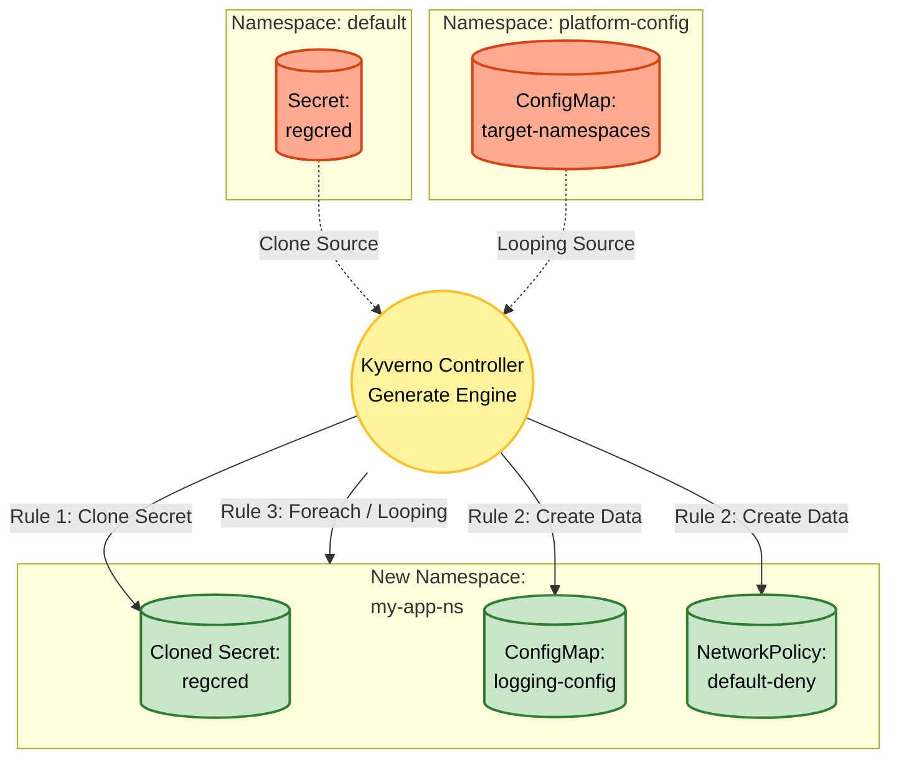

# Kyverno Project 4 – Automating "Ready-to-use" Namespaces with Generate Policy

## Foundational Theory

### Problem to Solve

In Kubernetes operations, initializing a new Namespace often involves repetitive "boilerplate" tasks:
1. **Manual Secret Copying**: Copying Secrets such as `regcred` (Image Pull Secret) or TLS certificates into the new Namespace.
2. **Missing Default Configurations**: DevOps engineers easily forget to apply basic security and system configurations like NetworkPolicies (Default Deny) or ConfigMaps (logging configuration).
3. **Complex Resource Distribution**: When distributing a resource (e.g., a specific NetworkPolicy) to a list of Namespaces, repeating this manually is time-consuming and error-prone.
4. **Retroactive Challenges**: How can these automated configurations be applied to Namespaces that **already exist**?

### Solution: Kyverno GeneratingPolicy

Kyverno solves this issue using the **Generate** mechanism, which automatically generates Kubernetes resources based on events (e.g., Namespace creation).

In Project 4, we focus on advanced features of the Generate rule:
- **Clone Source mode**: Synchronizes and copies resources from a source Namespace to a new Namespace.
- **Data Source mode**: Direct definition of the resource configuration data within the Policy itself.
- **Looping**: Processes lists (e.g., Namespace list from a ConfigMap) to generate resources in bulk using `foreach`.
- **Generate Existing**: Applies policies retroactively to generate resources for existing objects.

### Kyverno Components Used in Project 4
- **ClusterPolicy / GeneratingPolicy**: Uses the `generate` rule instead of `mutate` or `validate`.
- **`generate.clone`**: Specifies the source resource to copy (namespace, name).
- **`generate.data`**: Direct declaration of the resource configuration to create (ConfigMap, NetworkPolicy).
- **`matchConstraints` / `variables`**: Captures Namespace creation events and processes data.
- **`evaluation.synchronize`**: Ensures target resources are updated if the source resource or Policy changes.
- **`evaluation.generateExisting.enabled`**: (Advanced option) enables resource generation for existing Namespaces in the cluster.

---

## Overall Architecture

This project transforms Namespace creation into a "Ready-to-use" automated pipeline, ensuring a Namespace has sufficient Secrets, Configurations, and Security upon creation:



### Detailed Analysis of Functional Blocks (Rules):

| Rule | Mechanism | Task |
|---|---|---|
| **1. Clone regcred** | `generate.clone` | Listens for Namespace creation events, automatically copying the `regcred` Secret from the `default` namespace to the newly created namespace. |
| **2. Default Configs** | `generate.data` | Automatically initializes `logging-config` ConfigMap and `default-deny` NetworkPolicy in the new Namespace. Supports creating multiple downstream objects. |
| **3. Looping Distribution**| Looping (`foreach`) | Reads `data.namespaces` (e.g., `ns1,ns2,ns3`) from a central ConfigMap. Uses a string split function (`split`) to distribute configurations (e.g., advanced NetworkPolicies) to each Namespace in the list. Supports filtering (`allowlist`) and index naming (`np-0`, `np-1`). |
| **4. Generate Existing** | `generateExisting: true` | Applies policies retroactively to scan and clone/generate resources for existing Namespaces. |

---

## Deployment Guide

### Step 1: Prepare Source Resources

```bash
# 1. Create source Secret in the default namespace
kubectl create secret generic regcred \
  --from-literal=username=admin \
  --from-literal=password=secretpass \
  -n default

# 2. Create the ConfigMap containing target namespaces for Looping
kubectl create ns platform-config
kubectl create configmap target-namespaces \
  --from-literal=namespaces="ns-alpha,ns-beta,ns-gamma" \
  -n platform-config
```

### Step 2: Grant RBAC Permissions to Kyverno

Since the Kyverno Controller directly creates resources (Secrets, ConfigMaps, and NetworkPolicies), it must be granted the necessary RBAC permissions.

```bash
kubectl apply -f kyverno-rbac.yaml
```

### Step 3: Deploy the Generate Policies

```bash
# Deploy Clone Secret Policy
kubectl apply -f kyverno-clone-secret.yaml

# Deploy Data Generation Policy (ConfigMap, NetworkPolicy)
kubectl apply -f kyverno-generate-data.yaml

# Deploy Looping Resource Distribution Policy
kubectl apply -f kyverno-looping-generate.yaml
```

### Step 4: Enable Generate Existing (Optional)

To apply policies to existing Namespaces, configure the policy:
```yaml
spec:
  generateExistingOnPolicyUpdate: true
  rules:
    - name: ...
      generate:
        synchronize: true
        ...
```

---

## User Guide (For Developers)

Once the Policies are running, the developer workflow is extremely simple:

**Simply create a Namespace:**
```bash
kubectl create ns my-backend-service
```

Kyverno works behind the scenes immediately. You can check if the Namespace is "ready to use":

```bash
# Check cloned Secret
kubectl get secret regcred -n my-backend-service

# Check default ConfigMap
kubectl get cm logging-config -n my-backend-service

# Check NetworkPolicy
kubectl get networkpolicy default-deny -n my-backend-service
```

---

## Test Cases

### Test Case 1: Automatic Secret Cloning on Namespace Creation

**Goal:** Ensure the Secret is automatically copied to the new namespace.

```bash
kubectl create ns test-clone-ns
kubectl get secret regcred -n test-clone-ns
```
**Expected Result:** The `regcred` Secret exists in the namespace with the same configuration as the source in `default`.

---

### Test Case 2: Automatic Resource Generation from Data (ConfigMap, NetPol)

**Goal:** Ensure the new Namespace automatically receives a NetworkPolicy blocking all traffic and a logging configuration.

```bash
kubectl create ns test-data-ns
kubectl get networkpolicies,configmaps -n test-data-ns
```
**Expected Result:** Displays `networkpolicy.networking.k8s.io/default-deny` and `configmap/logging-config`.

---

### Test Case 3: Bulk Distribution using Looping

**Goal:** Ensure Kyverno reads the `target-namespaces` ConfigMap and generates resources in the listed Namespaces.

> Note: The `looping-generate-resources` Policy is triggered by updates to the `target-namespaces` ConfigMap. Therefore, the target namespaces must exist beforehand, or we must update the ConfigMap to trigger Kyverno.

```bash
# 1. Create the target namespaces first
kubectl create ns ns-alpha
kubectl create ns ns-beta

# 2. Update (or create) the ConfigMap to trigger the Policy
kubectl annotate configmap target-namespaces -n platform-config trigger=now --overwrite

# 3. Check the resources generated by Looping
kubectl get networkpolicies -n ns-alpha
kubectl get networkpolicies -n ns-beta
```
**Expected Result:** Kyverno parses the `ns1,ns2,ns3` array and automatically distributes the corresponding resources (e.g., `np-0`, `np-1`).

---

### Test Case 4: Synchronize & Generate Existing

**Goal:** Verify Kyverno automatically applies policies retroactively and restores resources if they are deleted.

1. **Test Re-generation (Synchronize):**
```bash
kubectl delete secret regcred -n test-clone-ns
kubectl get secret regcred -n test-clone-ns
```
**Result:** The Secret is automatically recreated (due to `synchronize: true`).

2. **Test Generate Existing:**
Create a namespace **before** applying a policy configured with `generateExisting`. Kyverno will automatically generate resources for the pre-existing namespace.

---

## Production Deployment Notes

1. **Kyverno Permissions (RBAC):**
   When using `generate` rules, the Kyverno Controller directly creates resources (Secrets, ConfigMaps, NetworkPolicies). Ensure the Kyverno ServiceAccount has `create/update/delete/get` permissions for these resources.

2. **Looping Performance:**
   Parsing large arrays (e.g., hundreds of namespaces) from a ConfigMap and generating resources can create instantaneous load on the Kubernetes API. Keep array sizes reasonable and run performance tests.

3. **Caution with `synchronize: true`:**
   While helpful to maintain consistency, if developers manually modify their NetworkPolicy, Kyverno will overwrite it back to the baseline configuration.

4. **Avoiding Infinite Loops:**
   Configure `match/exclude` blocks carefully to prevent Kyverno from generating resources in system Namespaces (e.g., `kube-system`, `kyverno`).