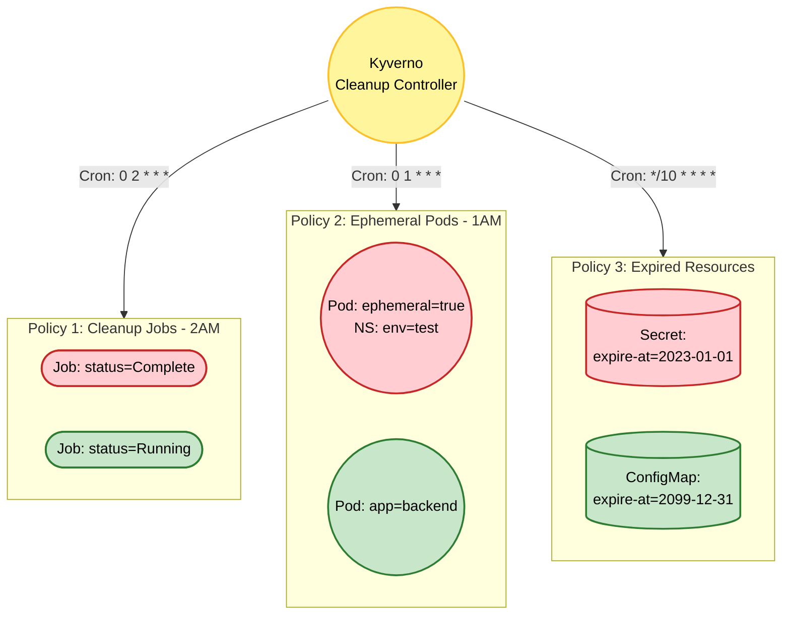

# Kyverno Project 5 – Garbage Collection & Lifecycle: Automation with Cleanup Policy (DeletingPolicy)

## Foundational Theory

### Problem to Solve

During Kubernetes operations, the system regularly accumulates junk resources over time:
1. **Completed Jobs**: CronJobs or Jobs that run to completion but are not deleted, cluttering the Namespace and impacting etcd performance.
2. **Ephemeral Resources**: Pods used for testing or debugging that are forgotten, continuing to consume compute resources (CPU/RAM).
3. **Expired Secrets/ConfigMaps**: TLS certificates, temporary tokens, or marketing campaign configurations that have expired but remain in the system, posing security risks.

Manual cleanup using `kubectl delete` commands or writing custom bash scripts scheduled via cron is labor-intensive, difficult to manage centrally, and prone to errors (such as accidentally deleting the wrong resources).

### Solution: Kyverno CleanupPolicy (DeletingPolicy)

Starting from version 1.9, Kyverno introduced the **`CleanupPolicy`** (and `ClusterCleanupPolicy`) to automate resource cleanup according to a defined schedule (Cron Schedule). (Previously, this functionality was referred to as a deletion or cleanup function).

In Project 5, we utilize the following features:
- **`schedule` (cron)**: Defines when the cleanup runs (e.g., `0 2 * * *` - 2:00 AM).
- **`conditions`**: Filters resources (e.g., deleting Jobs only when `status.conditions` is `Complete`).
- **`variables` and CEL Time Functions**: Uses the `now()` time function to compare and delete resources labeled with expiration dates (`expire-at`).
- **`deletionPropagationPolicy`**: Controls how child resources are deleted (Cascade delete).

### Kyverno Components Used in Project 5
- `CleanupPolicy` (applies to a specific Namespace).
- `ClusterCleanupPolicy` (applies cluster-wide).
- `match` blocks to filter `jobs`, `pods`, `secrets`, and `configmaps`.
- Event logs for Auditing (identifying who deleted what).

---

## Overall Architecture

This project comprises three independent, automated cleanup workflows:



### Detailed Analysis of 3 Policies:

| Policy | Type | Task |
|---|---|---|
| **1. Cleanup Completed Jobs** | `CleanupPolicy` | Runs at 2:00 AM (`0 2 * * *`) in the `batch-prod` namespace. Finds and deletes all `batch/v1` Jobs where `status.conditions[?type=='Complete'].status == 'True'`. |
| **2. Cleanup Ephemeral Pods** | `ClusterCleanupPolicy` | Runs at 1:00 AM (`0 1 * * *`). Deletes all Pods in the cluster labeled with `ephemeral=true` within Namespaces labeled with `environment=test`. |
| **3. Cleanup Expired Configs**| `ClusterCleanupPolicy` | Compares the current time `time.now()` with the value in the `expire-at: YYYY-MM-DD` label. Deletes Secrets/ConfigMaps if the expiration date is in the past. |

---

## Deployment Guide

### Step 1: Prepare the Environment (Generate "Junk" to clean up)

```bash
# 1. Prepare environment for Jobs
kubectl create ns batch-prod

# Create a "completed" Job (Sleep for 1s)
kubectl apply -f - <<EOF
apiVersion: batch/v1
kind: Job
metadata:
  name: completed-job
  namespace: batch-prod
spec:
  template:
    spec:
      containers:
      - name: busybox
        image: busybox
        command: ["sleep", "1"]
      restartPolicy: Never
EOF

# 2. Prepare environment for Ephemeral Pods
kubectl create ns test-env
kubectl label ns test-env environment=test
kubectl run test-pod -n test-env --image=nginx --labels="ephemeral=true"

# 3. Create an expired Secret
kubectl create ns platform-config
kubectl create secret generic old-cert \
  --from-literal=key=value \
  -n platform-config
kubectl label secret old-cert -n platform-config expire-at="2023-01-01"
```

### Step 2: Grant RBAC Permissions to Kyverno Cleanup Controller

Unlike the Admission Controller, the Cleanup feature requires granting deletion permissions to the `kyverno-cleanup-controller` ServiceAccount.

```bash
kubectl apply -f kyverno-rbac.yaml
```

### Step 3: Deploy the Cleanup Policies

```bash
kubectl apply -f kyverno-cleanup-jobs.yaml
kubectl apply -f kyverno-cleanup-pods.yaml
kubectl apply -f kyverno-cleanup-expired.yaml
```

---

## User Guide (For Developers)

As a developer, you do not need to manually delete temporary resources. You only need to attach the correct **Labels** when creating resources:

1. **For Test Pods:**
   Attach the `ephemeral: "true"` label when creating test Pods. Kyverno will clean them up at 1:00 AM the next day, releasing CPU/RAM back to the Cluster.
2. **For Temporary Secrets/ConfigMaps:**
   Add the `expire-at: "YYYY-MM-DD"` label.
   ```yaml
   apiVersion: v1
   kind: Secret
   metadata:
     name: promo-campaign
     labels:
       expire-at: "2024-12-31" # Kyverno will automatically delete this resource after this date
   ```

---

## Test Cases

### Test Case 1: Job Cleanup (Delete completed Jobs)

**Goal:** Wait for a Job to complete and verify that Kyverno deletes it as scheduled.

1. Verify the Job has completed:
```bash
kubectl get jobs -n batch-prod
# Status should be: COMPLETED 1/1
```
2. *(Testing Tip)* Update the cron schedule in the Policy to `* * * * *` (run every minute) to avoid waiting until 2:00 AM.
3. Wait 1 minute and verify:
```bash
kubectl get jobs -n batch-prod
```
**Expected Result:** The `completed-job` has been successfully deleted from the system!

---

### Test Case 2: Verify Logs (Auditing)

How do you know what Kyverno deleted? Kyverno's cleanup actions are recorded in the logs of the `kyverno-cleanup-controller` (instead of generating Kubernetes Events like standard Policies).

```bash
# Filter logs from the Cleanup Controller to check "deleted" actions
kubectl logs -n kyverno -l app.kubernetes.io/component=cleanup-controller | grep -i "deleted"
```
**Expected Result:** Logs will indicate the resource name, namespace, and the policy that triggered the deletion.

---

### Test Case 3: Comparing Time Variables (Time Functions)

**Goal:** Secrets with an expiration date in the past are deleted, while Secrets with an expiration date in the future are preserved.

```bash
# Tip: Update the policy cron schedule to run every minute (* * * * *)

# Create an expired Secret (2020)
kubectl create secret generic bad-secret --from-literal=x=y
kubectl label secret bad-secret expire-at="2020-01-01"

# Create an active Secret (2099)
kubectl create secret generic good-secret --from-literal=x=y
kubectl label secret good-secret expire-at="2099-01-01"
```

**Expected Result:** After 1 minute, `bad-secret` is deleted, while `good-secret` remains.

---

## Production Deployment Notes

1. **API Server Load:**
   Do not configure `schedule: "* * * * *"` on large production systems. Having Kyverno scan (list) all resources in the cluster every minute can overload the kube-apiserver and etcd. Schedule cleanups during off-peak hours (e.g., `0 2 * * *`).
   
2. **`deletionPropagationPolicy` Considerations:**
   When Kyverno deletes a Job, Kubernetes may leave the associated Pods as orphans by default. Ensure the Policy configures `deletionPropagationPolicy: Background` or `Foreground` to clean up child resources (Pods) cleanly.

3. **RBAC for Cleanup Controller:**
   The Cleanup feature runs under the `kyverno-cleanup-controller` ServiceAccount. If you write a Policy to clean up a CustomResource (CRD), you **must** grant `delete`, `list`, and `get` permissions on that CRD to the ServiceAccount via a ClusterRole.