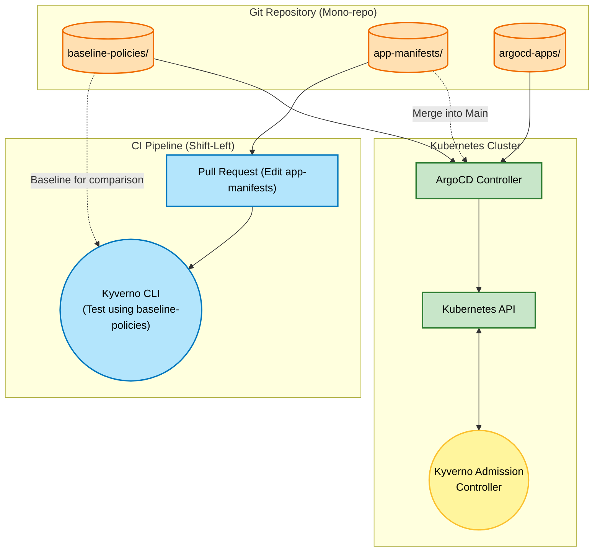

# Kyverno Project 6 – GitOps & Policy-as-Code: Integrating Flux/ArgoCD and Kyverno

## Foundational Theory

### Problem to Solve

When managing Kubernetes at scale (Enterprise), manually applying YAML files (via `kubectl apply`) is unsafe, difficult to audit, and lacks traceablity.
Furthermore, if developers only discover that their application configuration violates policies (e.g., missing resource limits, using unauthorized registries) at the final step of deploying to the cluster, it leads to frustration and wasted time.

**Requirements:**
1. All infrastructure and application changes must be stored in Git (Single Source of Truth).
2. Automate the synchronization (Sync) from Git to the Cluster.
3. Catch errors early (Shift-Left Security): Developers should know if their configurations are valid as soon as they create a Pull Request (PR).
4. Safe exception handling: Allow exceptions (Bypass) for specific applications without weakening the overall system policies.

### Solution: Combining GitOps + Kyverno

Project 6 represents the pinnacle of modern Kubernetes management, combining the philosophies of **GitOps** (using ArgoCD or FluxCD) and **Policy-as-Code** (using Kyverno).

In this project, we apply advanced Kyverno concepts:
- **Comprehensive Policies**: Combine all policy rules (Validate, Mutate, Generate, Cleanup, ImageVerify) into a standardized "Baseline Policy".
- **Kyverno CLI (`kyverno apply`)**: A CLI tool integrated into CI (GitHub Actions, GitLab CI) to test manifests directly on Pull Requests.
- **PolicyException CRD**: A resource that enables clean, transparent policy exceptions (bypassing rules) for specific scenarios without cluttering ClusterPolicies with numerous `exclude` blocks.

---

## Project Directory Structure (Mono-repo)

This project uses a GitOps Mono-repo model containing the following directories:

- **`.github/workflows/`**: Contains the CI/CD workflow (GitHub Actions) to automatically validate application configurations (Shift-Left Testing) using the Kyverno CLI on every Pull Request.

- **`baseline-policies/`**: Contains the security and operational baselines (Kyverno ClusterPolicies) that act as the guardrails for the system.

- **`app-manifests/`**: Contains the developers' application configurations (Pods, Deployments, Services) and exceptions (`policy-exception.yaml` and `bad-pod.yaml`).

- **`argocd-apps/`**: Contains ArgoCD `Application` definitions to automatically sync code from Git to the Kubernetes Cluster.

### Workflow Diagram



### Detailed Architectural Analysis:

1. **Centralized Management (GitOps):** All resources—from application configurations and security policies to ArgoCD installation definitions—are stored in a single Mono-repo. The `argocd-apps/` directory serves as the bootstrap component, telling ArgoCD to automatically track and sync the remaining directories (`baseline-policies` and `app-manifests`) into the cluster.

2. **Shift-Left Testing (Early Protection):** When a developer modifies files in `app-manifests/` and creates a Pull Request, the GitHub Actions workflow (under the `.github/` directory) is triggered. The Kyverno CLI loads the rules from `baseline-policies/` and validates the manifests directly within the PR. If there are configuration errors, the PR check fails, preventing it from being merged.

3. **Continuous Deployment (Continuous Synchronization):** Once the PR is approved and merged into the `main` branch, ArgoCD detects the change on Git and immediately synchronizes it to the Kubernetes API Server. ArgoCD's Self-Heal feature ensures that the cluster state always matches Git (automatically overwriting manual cluster changes).

4. **Final Gatekeeper (Admission Control):** Even when configurations are synced by ArgoCD to the Cluster, the Kyverno Admission Webhook (running in the cluster) intercepts the request. It evaluates the deployment against active ClusterPolicies, providing double protection for the system.

---

## Detailed Deployment Guide

### Step 1: Initialize the Cluster and GitOps Tools
Ensure that the core components are installed on the Kubernetes cluster:
- **Kyverno** (via Helm chart)
- **ArgoCD** (via Helm/CLI)

### Step 2: Build the "Baseline Policies"
The `baseline-policies/` directory contains the core policies:
- `require-labels.yaml` (Validate): Enforces that Pods must have the `app` label.
- `add-default-resources.yaml` (Mutate): Automatically injects CPU/Memory resource defaults if missing.
- `auto-clone-secrets.yaml` (Generate): Automatically clones required Secrets.
- `cleanup-ephemeral.yaml` (Cleanup): Cleans up temporary testing Pods.
- `restrict-image-registries.yaml` (Validate): Restricts image downloads to `registry.tranvix.click` only.

### Step 3: Configure the CI Pipeline (Shift-Left) with GitHub Actions
The `.github/workflows/pr-test.yaml` workflow automates pull request validation.
When a developer modifies a file in the `app-manifests/` directory and opens a PR, GitHub Actions installs the Kyverno CLI and executes:
```bash
kyverno apply ./baseline-policies/ -r ./app-manifests/
```
If the developer's manifests violate any policies in `baseline-policies`, the PR is blocked immediately.

### Step 4: Deploy with ArgoCD
Instead of using manual `kubectl apply` commands, we delegate synchronization to ArgoCD.
The `argocd-apps/` directory contains two `Application` definitions:
1. `baseline-policies-app.yaml`: Instructs ArgoCD to continuously sync the `baseline-policies/` directory.
2. `app-manifests-app.yaml`: Instructs ArgoCD to sync the `app-manifests/` directory.

Run the following command once to bootstrap the deployment:
```bash
kubectl apply -f argocd-apps/
```
From this point forward, ArgoCD automatically maintains consistency between Git and the Cluster.

### Step 5: Initialize a Policy Exception
Allow a specific application to bypass a policy.
Inside the `app-manifests/` directory, you will find `policy-exception.yaml`:

```yaml
apiVersion: kyverno.io/v2alpha1
kind: PolicyException
metadata:
  name: bypass-image-check-for-test-app
  namespace: test-namespace
spec:
  exceptions:
  - policyName: restrict-image-registries
    ruleNames:
    - validate-registries
  match:
    any:
    - resources:
        kinds:
        - Pod
        names:
        - test-app-*
        namespaces:
        - test-namespace
```

This file is synchronized to the Cluster by ArgoCD. Kyverno reads it and grants a bypass ticket to `test-app` Pods, allowing them to skip the `validate-registries` rule.

---

## User Guide (For DevOps & Developers)

- **For Developers:** No direct access to the cluster is needed. Simply define the application manifest YAML, push it to Git, and inspect the CI pipeline results for any validation errors. Fix the manifests and merge.

- **For DevOps:** Manage all policies centrally on Git. If a development team requests an exception, create a `PolicyException` file and push it to Git. Once testing is complete, delete the file from Git to restore 100% security enforcement.

---

## In-Depth Test Cases

Follow these step-by-step instructions to experience the combined power of GitOps and Kyverno.

### Test Case 1: Shift-Left CI

**Goal:** Verify that misconfigurations are caught during the coding phase before they reach the cluster.

**Steps:**
1. **Create a New Branch:** Simulate a developer workflow.
   ```bash
   git checkout -b feature-test-ci
   ```
2. **Introduce a Misconfiguration:** Open `app-manifests/bad-pod.yaml`, remove the `app` label, and change the image to an unauthorized registry (e.g., `nginx:latest` instead of the Private Registry).
3. **Push to GitHub (Push & PR):**
   ```bash
   git add app-manifests/bad-pod.yaml
   git commit -m "Add bad-pod"
   git push -u origin feature-test-ci
   ```
4. **Create a Pull Request:** Open a PR on GitHub to merge the `feature-test-ci` branch into `master`.
5. **Observe the CI Pipeline:**
   - GitHub Actions is triggered immediately (visible in the "Checks" section of the PR).
   - Under the hood, GitHub Actions runs the `kyverno apply` tool to validate `bad-pod.yaml` against the policies in `baseline-policies/`.
   - **Result:** The checks fail with a red cross (Failed) and exit code 1.
   - **View Error Details:** In the GitHub Actions log, Kyverno CLI indicates:
     - *`validation error: Label 'app' is required.`*
     - *`validation error: Unknown image registry.`*
   - Reviewers can block the PR until these errors are fixed.

### Test Case 2: GitOps Sync & Admission Block

**Goal:** Verify how Kyverno acts as the final gatekeeper in the cluster if a configuration bypasses CI (e.g., via a forced merge).

**Steps:**
1. **Force Merge the Invalid Manifest:** Force merge the invalid `bad-pod.yaml` file into the `master` branch on GitHub.
2. **ArgoCD Sync:**
   - ArgoCD detects the change on `master` immediately.
   - It attempts to deploy the Pod using `nginx:latest` to the Kubernetes cluster.
3. **Kyverno Webhook Interception:**
   - Before the Pod is written to `etcd`, the Kyverno Admission Webhook intercepts and halts the request.
   - Kyverno evaluates the Pod against `restrict-image-registries` and `require-labels` policies.
4. **Observe ArgoCD Status:**
   - On the ArgoCD dashboard, the application `k8s-app-manifests` displays a yellow status (**`OutOfSync`**) and a Health status of **`Missing`**.
   - Clicking on the sync status reveals the detailed error block from Kyverno:
     > `admission webhook "validate.kyverno.svc-fail" denied the request: resource Pod/test-namespace/bad-pod was blocked due to the following policies...`
   - **Conclusion:** The invalid manifest cannot be deployed to the cluster.

### Test Case 3: PolicyException Flexibility (Controlled Exceptions)

**Goal:** Provide controlled flexibility by allowing a specific application to bypass strict rules without changing the overall policies.

**Steps:**
1. **The Policy:** The `restrict-image-registries` policy mandates that all images must be pulled from `registry.tranvix.click` only.
2. **The Exception Request:** A development team needs to deploy `test-app-1` (defined in `test-app.yaml`) using `nginx:latest` (from DockerHub) for testing.
3. **Grant an Exception:**
   - DevOps creates a `policy-exception.yaml` manifest, declaring: *Allow Pods named `test-app-*` in the `test-namespace` Namespace to bypass the image registry check.*
   - This exception file is reviewed and synced to the cluster via ArgoCD.
4. **Observe the Result:**
   - ArgoCD deploys `test-app-1`. Kyverno verifies the PolicyException, allows the Pod, and the application shows a green status (**`Synced`** and **`Healthy`**).
   - If a hacker attempts to bypass this by creating a pod named `hacker-app` using `nginx:latest`, it will be blocked because its name does not match the exception pattern `test-app-*`.
   - **Conclusion:** Security remains intact while providing authorized flexibility.

---

## Production Deployment Notes

1. **Enable Policy Exceptions:**
   The `PolicyException` feature must be enabled in the Kyverno configuration (e.g., setting `enablePolicyException: true` in the Helm values or container args).

2. **GitOps Discipline:**
   When using GitOps, **never** modify policies directly in the cluster using `kubectl edit`. ArgoCD's Self-Heal feature will automatically overwrite manual changes to maintain consistency with Git.

3. **Repository Access Control:**
   Strictly control write access to the `baseline-policies/` and `argocd-apps/` directories. Only DevOps leads or security teams should be authorized to approve PRs for these paths.