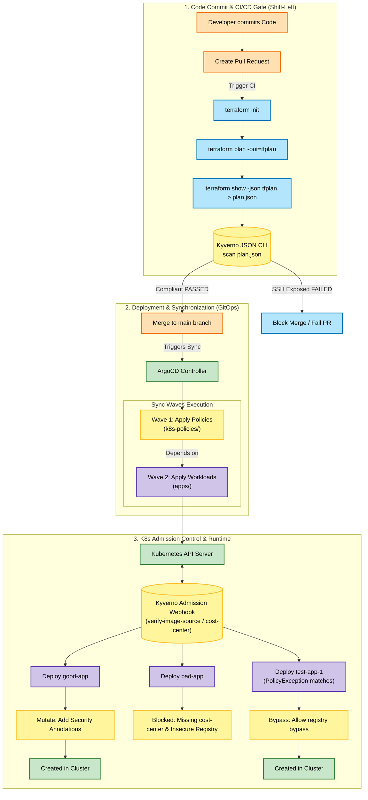

# Project 7 – Full-stack DevSecOps: Terraform + CI/CD + GitOps + Kyverno

## 1. Introduction

Project 7 is the final and most comprehensive milestone in this repository. It integrates the **4 pillars** of modern Cloud-Native Infrastructure into a fully automated End-to-End DevSecOps Pipeline:

1. **Infrastructure as Code (IaC) - Terraform:** Automates hardware provisioning (VPC, Security Groups, EC2 instances).
2. **Continuous Integration (CI) - GitHub Actions:** Runs static analysis, security validation, and policy compliance checks before merging code.
3. **Continuous Delivery (CD) - GitOps with ArgoCD:** Automatically synchronizes and enforces the desired state of Kubernetes manifests and policies directly from Git.
4. **Policy-as-Code - Kyverno & Kyverno JSON:** Establishes security guardrails across both infrastructure (Shift-Left validation of Terraform plans) and container runtimes (Admission Control).

---

## 2. System Architecture

The project is structured as a Git Mono-repo to segregate duties between platform teams (managing policies and infrastructure) and development teams (managing application code).

### 2.1 Directory Structure

- [.github/workflows/infra-ci.yaml](file:///home/kubernetes/kyverno/kyverno-project-7/.github/workflows/infra-ci.yaml): Automated CI pipeline running Terraform checks and `kyverno-json` scans on PRs.
- [terraform/](file:///home/kubernetes/kyverno/kyverno-project-7/terraform/): Source Terraform files creating a VPC, EC2 instance, and Security Group.
- [policies/tf-policies/check-ssh-public.yaml](file:///home/kubernetes/kyverno/kyverno-project-7/policies/tf-policies/check-ssh-public.yaml): Kyverno JSON policy validating Terraform plans for public SSH vulnerabilities.
- [policies/k8s-policies/advanced-policies.yaml](file:///home/kubernetes/kyverno/kyverno-project-7/policies/k8s-policies/advanced-policies.yaml): Cluster-level Kyverno policies covering Image verification, resource mutation, network policy generation, label validation, and resource cleanup.
- [apps/](file:///home/kubernetes/kyverno/kyverno-project-7/apps/): Kubernetes manifests representing different application workloads (good, bad, exception) deployed by developers.
- [argocd/app-of-apps.yaml](file:///home/kubernetes/kyverno/kyverno-project-7/argocd/app-of-apps.yaml): ArgoCD bootstrap application configuration coordinating deployment order.
- [tests/k8s/](file:///home/kubernetes/kyverno/kyverno-project-7/tests/k8s/): Declarative unit test suites verifying K8s policies using Kyverno CLI.

---

## 3. Architecture & Application Flow

The diagram below details the end-to-end security checking flow, spanning from a developer modifying Terraform code to admission control during GitOps runtime deployment.



---

## 4. Step-by-Step Deployment & GitOps Integration

To deploy and maintain this configuration using GitOps, we enforce separation of dependencies using ArgoCD Sync Waves.

### Step 1: Bootstrapping ArgoCD (App-of-Apps)
Apply the bootstrap application config. It establishes the synchronization of both policies and workload applications:
```bash
kubectl apply -f argocd/app-of-apps.yaml
```

ArgoCD coordinates the sync process using the `argocd.argoproj.io/sync-wave` annotation in [app-of-apps.yaml](file:///home/kubernetes/kyverno/kyverno-project-7/argocd/app-of-apps.yaml):
1. **Wave 1 (`project-7-policies`):** Provisions Kyverno cluster-wide rules ([advanced-policies.yaml](file:///home/kubernetes/kyverno/kyverno-project-7/policies/k8s-policies/advanced-policies.yaml)) first.
2. **Wave 2 (`project-7-apps`):** Deploys application manifests ([good-app.yaml](file:///home/kubernetes/kyverno/kyverno-project-7/apps/good-app.yaml), [bad-app.yaml](file:///home/kubernetes/kyverno/kyverno-project-7/apps/bad-app.yaml), and [exception.yaml](file:///home/kubernetes/kyverno/kyverno-project-7/apps/exception.yaml)).

This dependency logic guarantees that application manifests are never processed before their policies are loaded, preventing deployment race conditions.

---

## 5. In-Depth Test Cases & Expected Outcomes

### Test Case 1: Shift-Left CI (Static IaC Plan Scanning)
This test validates that infrastructure changes are validated against policies *before* any resource is provisioned on the cloud provider.

#### Local Execution Command
Run the scan command locally using the Kyverno JSON CLI to verify the Terraform JSON plan configuration:
```bash
./bin/kyverno-json scan --payload terraform/plan.json --policy policies/tf-policies/
```

#### Expected Scan Result & Output
The scan detects that the security group opens SSH port 22 to the public internet (`0.0.0.0/0`), failing validation as expected:
```
Loading policies ...
Loading payload ...
Pre processing ...
Running ( evaluating 1 resource against 1 policy ) ...
- check-ssh-public / check-ssh-public /  FAILED
 -> all[0].check.(length(planned_values.root_module.resources[?type == 'aws_security_group'].values.ingress[][] | [?from_port <= `22` && to_port >= `22` && contains(cidr_blocks, '0.0.0.0/0')] || `[]`)): Invalid value: 1: Expected value: 0
Done
```
* **Why it fails:** The rule in [check-ssh-public.yaml](file:///home/kubernetes/kyverno/kyverno-project-7/policies/tf-policies/check-ssh-public.yaml) checks for ingress rules exposing port 22. It finds exactly `1` match, which violates the assertion of having `0` matches.
* **CI Action:** If triggered on GitHub Actions, the workflow runner exits with code `1`, blocking the Pull Request from merging.

---

### Test Case 2: K8s Policy Compliance Unit Tests
This test simulates cluster admission control testing locally without needing a live Kubernetes cluster.

#### Local Execution Command
Run the Kyverno CLI unit testing tool against the declarative test manifests:
```bash
./bin/kyverno test tests/k8s/
```

#### Expected Test Result & Output
Kyverno processes all resources defined in [tests/k8s/kyverno-test.yaml](file:///home/kubernetes/kyverno/kyverno-project-7/tests/k8s/kyverno-test.yaml) and reports:
```
Loading test  ( tests/k8s/kyverno-test.yaml ) ...
  Loading values/variables ...
  Loading policies ...
  Loading resources ...
  Loading exceptions ...
  Applying 4 policies to 4 resources with 1 exception ...
  Checking results ...

│──────────│─────────────────────────────│───────────────────────────│───────────────────────────│────────│────────│
│ ID (14)  │ POLICY                      │ RULE                      │ RESOURCE                  │ RESULT │ REASON │
│──────────│─────────────────────────────│───────────────────────────│───────────────────────────│────────│────────│
│ 1        │ verify-image-source         │ check-registry            │ v1/Pod/default/good-app   │ Pass   │ Ok     │
│ 2        │ verify-image-source         │ require-image-pull-secret │ v1/Pod/default/good-app   │ Pass   │ Ok     │
│ 3        │ verify-image-source         │ block-latest-tag          │ v1/Pod/default/good-app   │ Pass   │ Ok     │
│ 4        │ require-cost-center         │ check-cost-center         │ v1/Pod/default/good-app   │ Pass   │ Ok     │
│ 5        │ mutate-security-annotations │ add-security-annotation   │ v1/Pod/default/good-app   │ Pass   │ Ok     │
│ 6        │ verify-image-source         │ check-registry            │ v1/Pod/default/bad-app    │ Pass   │ Ok     │
│ 7        │ verify-image-source         │ require-image-pull-secret │ v1/Pod/default/bad-app    │ Pass   │ Ok     │
│ 8        │ verify-image-source         │ block-latest-tag          │ v1/Pod/default/bad-app    │ Pass   │ Ok     │
│ 9        │ require-cost-center         │ check-cost-center         │ v1/Pod/default/bad-app    │ Pass   │ Ok     │
│ 10       │ verify-image-source         │ check-registry            │ v1/Pod/default/test-app-1 │ Pass   │ Ok     │
│ 11       │ verify-image-source         │ block-latest-tag          │ v1/Pod/default/test-app-1 │ Pass   │ Ok     │
│ 12       │ verify-image-source         │ require-image-pull-secret │ v1/Pod/default/test-app-1 │ Pass   │ Ok     │
│ 13       │ require-cost-center         │ check-cost-center         │ v1/Pod/default/test-app-1 │ Pass   │ Ok     │
│ 14       │ generate-default-netpol     │ generate-deny-all         │ /default-deny-all         │ Pass   │ Ok     │
│──────────│─────────────────────────────│───────────────────────────│───────────────────────────│────────│────────│

Test Summary: 14 tests passed and 0 tests failed
```

#### Detailed Outcome Mapping
* **`good-app` validation:** Evaluates as `Pass`. It conforms to registry standards (`registry.awsfcaj.com`), declares an `imagePullSecret`, does not use `:latest`, and provides a `cost-center` label.
* **`good-app` mutation:** Evaluates as `Pass`. It successfully appends `security.company.com/managed: "true"` and `security.company.com/scanned-by: "kyverno"` annotations.
* **`bad-app` validation:** Evaluates as `Pass`. Because it uses `nginx:latest` and misses `cost-center`, the test engine expects the policy checks to **fail/block** the pod. Since the policy blocks it as designed, the assertion succeeds.
* **`test-app-1` validation:** Evaluates as `Pass`. The policy exception matches, allowing the registry and `:latest` tags to be skipped (`result: skip`). It is still validated for the `cost-center` label which it provides.
* **Downstream resource generation:** Evaluates as `Pass`. Creating a new Namespace successfully generates a `default-deny-all` `NetworkPolicy`.

---

### Test Case 3: ArgoCD Sync & Admission Block (Cluster Protection)
This test verifies the real cluster behavior when a configuration passes through GitOps synchronization.

#### Deployment Action
If you force-merge [bad-app.yaml](file:///home/kubernetes/kyverno/kyverno-project-7/apps/bad-app.yaml) (which contains an unapproved image registry and misses labels) into the `master` branch:

1. ArgoCD automatically pulls the changes and attempts to submit the Pod manifest to the Kubernetes cluster.
2. The Kyverno Admission Controller Webhook intercepts this creation request.
3. The webhook blocks the pod creation, returning the following validation messages:
   * `"Images must be pulled from the secure Private Registry: registry.awsfcaj.com/*"`
   * `"The ':latest' tag is strictly prohibited in Production."`
   * `"You must declare 'imagePullSecrets' to have permission to pull from the Private Registry."`
   * `"You must provide the 'cost-center' label for Cloud cost allocation."`

#### Expected ArgoCD UI Status
* The Application `project-7-apps` displays a **yellow** status representing **`OutOfSync`**.
* The Health status remains **`Missing`** because the Pod resource was rejected by Kyverno at admission time and never persisted to the cluster's `etcd`.